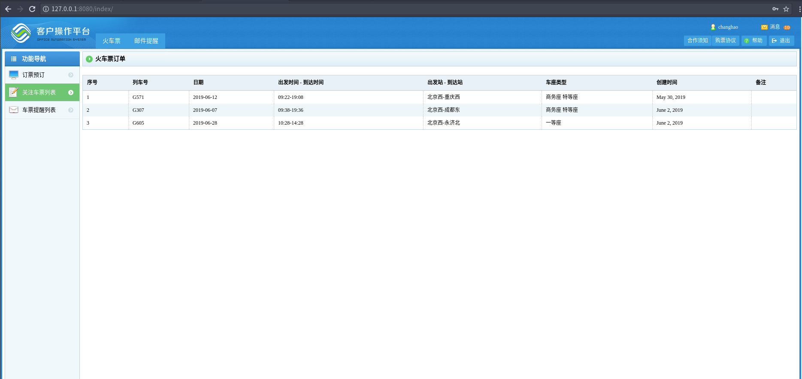

**分布式抢票系统**
Ncoreqp-distributed

内测: bases.1.10
上次修改时间：2019.06.03 02:59
最后修改时间：2019.06.04 22:26
Author: changhao
Mail: wu_chang_hao@qq.com

项目正在开发中, 敬请期待！
本项目秉成开源精神, 完全开源！
项目的初心, 为要买票回家的人, 用技术给他们提供一张回家的车票！
核心功能和中心思想暂时保密, 谢谢理解！

项目周期 2019.04.03 ~ 2019.04.24
如果童鞋们，有好想法可联系我邮箱：wu_chang_hao@qq.com，欢迎大家一块合作！

**技术实现概括**
    python3.6 + Django + GUI + Mysql + Nginx
    AES CBC 方式加密

**服务端**

    [ 进程1 ]
    1. 判断是否激活，分配id
        机制: 进程1, 清理取消的车票; 监听客户端socket请求

**客户端**

	[ 进程1 ]
	1. 首次激活, 获得id
        机制：进程1, 客户端发起无id号数据包, 服务端分配id号同时写入数据库;
            (1). 时间有效期10分钟, 间隔时间5秒, 客户端每五秒写入;

	2. 获取任务 (client_exec_task1)
        机制： 进程1, 60秒发送数据包获取新任务, 事先判断当前任务列表;
            (1). 判断是否是第一次发包
            (2). 180秒发送一次数据包, 获取新任务列表

    [ 进程2 ]
	3. 执行任务
        机制： 进程2, 循环执行任务,  一直到获取结果, 结束任务;
            (0). 检测机制: 日期是否小于今天,
            (1). 读取 task_data.pk 文件 获取任务;
			(2). 根据任务 爬虫 车票状态;
			(3). 多进程 (10);
			(4). 每进程 3 线程

    [ 进程3 ]
    4. 返回结果
        机制： 进程3, 向服务器返回结果

**changelog**
Tue Jun 04 2019 22:26 changhao<wu_chang_hao@qq.com>-vd1.2.9-bases1.10
- 内测版 bases.1.10 build-1.0

**废话不多说直接上图**

